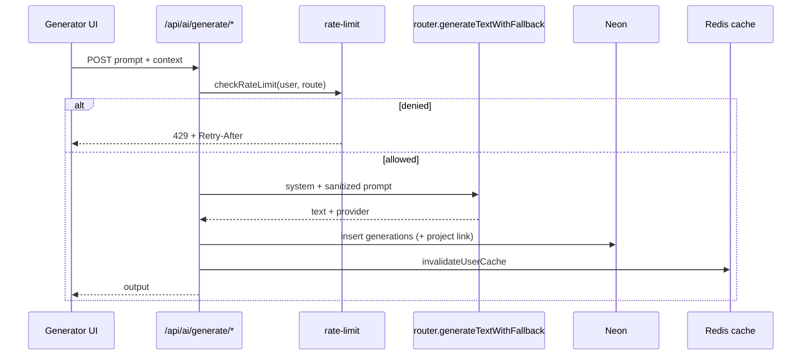

# Architecture

ContentAI is a Next.js App Router app: Clerk auth, Neon Postgres (Drizzle), Upstash Redis, Vercel AI SDK (Gemini + Groq), Pollinations images, and Uploadthing for durable media.

## Request flows

### Authenticated generation (text)



### Image generation

1. Build prompt (optionally with style continuity / reference analysis).
2. `generateImage` tries providers in order when keys exist:
   1. OpenAI DALL·E 3 (`OPENAI_API_KEY`)
   2. Recraft (`RECRAFT_API_KEY`)
   3. Stability Core (`STABILITY_API_KEY`)
   4. Pollinations Flux (always available fallback)
3. Bytes are rehosted via Uploadthing when `UPLOADTHING_TOKEN` is set; keyed provider URLs are never returned to clients.
4. Persist generation + linked project; `metadata.provider` records which backend produced the image.

```mermaid
flowchart TD
  A[POST /api/ai/generate/photo|poster] --> B[Rate limit]
  B --> C[Image provider router]
  C --> D{OPENAI_API_KEY?}
  D -->|yes| E[DALL·E 3]
  D -->|no / fail| F{RECRAFT_API_KEY?}
  F -->|yes| G[Recraft]
  F -->|no / fail| H{STABILITY_API_KEY?}
  H -->|yes| I[Stability]
  H -->|no / fail| J[Pollinations Flux]
  E --> K[Rehost / scrub secrets]
  G --> K
  I --> K
  J --> K
  K --> L[Persist generation + project]
```

### Public share

Published projects (`content_projects.is_public = true`) are readable at `/share/[id]` and `/api/share/[id]` without auth (see middleware public routes).

## Data model

| Table | Purpose | Cascade |
| --- | --- | --- |
| `users` | Clerk user mirror (`id` = Clerk user id) | — |
| `content_projects` | Block documents; optional `generation_id`, `is_public` | User delete → cascade; generation delete → `generation_id` set null |
| `generations` | AI outputs + metadata | User delete → cascade |
| `reference_images` | Uploadthing reference metadata | User delete → cascade |
| `user_preferences` | Tone/tool defaults, marketing opt-out, custom avatar | User delete → cascade |

Block shapes (`ContentBlock`): `heading` | `paragraph` | `image` | `divider` | `cta`.

Migrations live under `drizzle/` (`0000` … `0004`).

## AI text provider decision tree

Implemented in `src/lib/ai/router.ts` → `generateTextWithFallback`.

Default order: **Gemini → Groq**. Prefer Groq via `preferredProvider: "groq"`.

**Gemini models (in order):**

1. `gemini-3.5-flash`
2. `gemini-flash-latest`
3. `gemini-3.1-flash-lite`
4. `gemini-flash-lite-latest`

Per model: up to 4 attempts with delays 400 / 1 200 / 2 500 ms on retryable errors. Call timeout 45 s.

**Groq:** `llama-3.3-70b-versatile`, up to 3 attempts (500 / 1 500 ms), requires `GROQ_API_KEY`.

Prompts are built in `src/lib/ai/prompts/prompt-upgrade.ts` and sanitized via `src/lib/ai/sanitize.ts`. Outputs pass `moderateAiTextOutput` before persist/return.

## Rate limiting

`src/lib/rate-limit.ts` — 60 s sliding window, key `ratelimit:{userId}:{route}`.

| Route | Max / 60 s |
| --- | --- |
| tweet | 20 |
| blog | 10 |
| caption | 20 |
| photo | 5 |
| poster | 5 |
| prompt-upgrade | 10 |
| default | 20 |

- Redis configured: Lua sorted-set sliding window (atomic).
- Redis missing/error in **production**: fail closed (deny, retry after 60 s).
- Non-production: in-memory sliding window fallback.

## Clerk webhook sequence

`POST /api/webhooks/clerk` (`src/app/api/webhooks/clerk/route.ts`):

1. Require `CLERK_WEBHOOK_SECRET`.
2. Require Svix headers; reject timestamps outside ±300 s.
3. Verify signature against raw body.
4. `user.created` / `user.updated` → upsert `users`.
5. `user.deleted` → delete `users` (FK cascades).
6. DB failure → 500 (Clerk retries); success → 200.

## Cache invalidation

`src/lib/cache.ts` (Redis or memory fallback):

| Key | TTL |
| --- | --- |
| `user:synced:{id}` | 1 h |
| `user:profile:{id}` | 15 min |
| `dashboard:stats:{id}` | 2 min |
| `user:generations:{id}` / `:{limit}` | 2 min |
| `session:active:{id}` | 30 days |

`invalidateUserCache(userId)` clears dashboard + generation list keys (limits 20 and 50). Profile/synced/session are cleared selectively by callers (e.g. preferences update).

## Health checks

| Endpoint | Auth | Behavior |
| --- | --- | --- |
| `GET /api/health/live` | Public | Always 200 — process up |
| `GET /api/health/ready` | Public | 200 if DB `SELECT 1` + Redis set/get succeed; else 503 |

## Middleware public routes

`src/middleware.ts`: `/`, `/sign-in(.*)`, `/sign-up(.*)`, `/share(.*)`, `/api/webhooks(.*)`, `/api/share(.*)`, `/api/health(.*)`.

Signed-in users hitting landing/auth routes redirect to `/dashboard`.

## E2E scenarios (manual / future Playwright)

1. Sign in → dashboard loads stats.
2. Generate tweet → output renders → regenerate with remarks.
3. Generate photo → image URL/data renders → save appears in generations/projects.
4. Builder: new project → add/reorder blocks → save → `/builder/[id]`.
5. Publish project → open `/share/[id]` signed out → unpublish → 404.
6. Settings: save preferences, export JSON, custom avatar.
7. Account delete confirmation removes Clerk user + cascaded rows.

Automated coverage today: Vitest unit suite (`npm test` / `npm run test:coverage`) plus Playwright E2E (`npm run test:e2e`) and CI workflow `.github/workflows/ci.yml`.

### Playwright E2E

- `e2e/public.spec.ts` — health live, landing, sign-in shell, share 404 (no secrets required beyond app boot env).
- `e2e/generation.spec.ts` — Clerk sign-in + mocked AI/project APIs for photo regenerate, builder save, prompt upgrade. Requires `E2E_CLERK_USER_EMAIL` and `E2E_CLERK_USER_PASSWORD`.

```bash
npx playwright install chromium
npm run test:e2e
```
